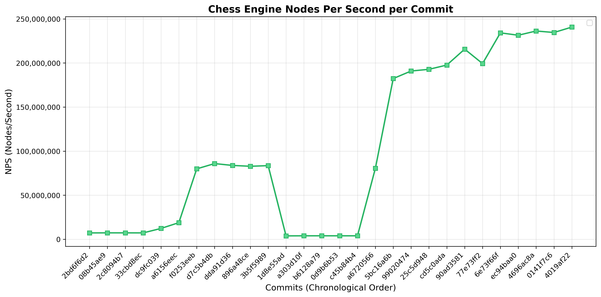

# Prokopakop

A moderately fast chess engine written in Rust that **kops the Prokop**.


<figure>
    
    <figcaption><em>Performance benchmarks across git commits on a i9-14900K. Benchmarks use perft 5, hashing and bulk-counting.</em></figcaption>
</figure>

## Technical Features

- **[Magic Bitboards](https://www.chessprogramming.org/Magic_Bitboards)** - Fast sliding piece move generation
- **[Generics](https://www.chessprogramming.org/Generic_Programming)** - Const generics for piece/color function variants
- **Iterative [Zobrist Hashing](https://www.chessprogramming.org/Generic_Programming)** - Position hashing for transposition tables

## Usage

### Build & Run
```bash
cargo build --release
./target/release/prokopakop
```

### Play Mode
For interactive command-line play:
```
play                          # Enter play mode
move <from><to>[promotion]   # Make move (e.g., e2e4, e7e8q)
unmove                        # Undo last move
status                        # Display board
fen                           # Show current FEN
moves                         # Show legal moves
moves <square>                # Show moves from square
moves <depth>                 # Run perft to depth
position startpos             # Reset board
position fen <FEN>            # Load FEN position
quit                          # Exit
```

### UCI Mode (WORK IN PROGRESS)
For chess GUI integration:
```
uci                           # Enter UCI mode
ucinewgame                    # Start a new game
position startpos             # Set starting position
position fen <FEN>            # Set position from FEN
go perft <depth>              # Run perft test
isready                       # Check engine readiness
quit                          # Exit
```

Other `go` commands are **not** supported; this is not a chess bot (yet).


### Command Line Options
```bash
prokopakop --fen "<FEN>"      # Start with FEN position
prokopakop --perft <depth>    # Run perft test
prokopakop --magic            # Generate magic bitboards
```

## Resources

- https://www.chessprogramming.org/Main_Page
- https://ameye.dev/notes/chess-engine/
- https://peterellisjones.com/posts/generating-legal-chess-moves-efficiently/
