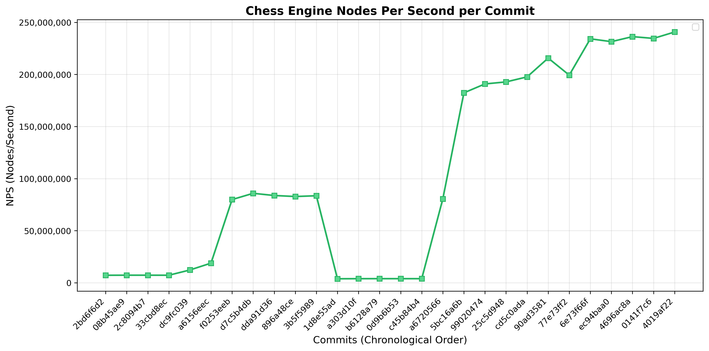
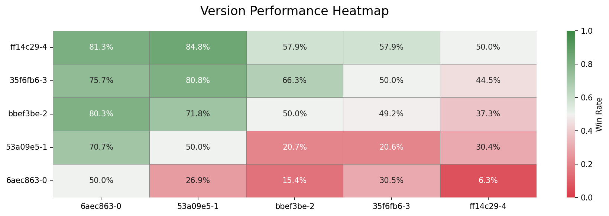

#  Prokopakop

A moderately fast UCI chess engine written in Rust that **kops the Prokop**.

**Challenge it on [Lichess](https://lichess.org/@/prokopakop)!**

## Technical Features

### Move Generation

- **[Magic Bitboards](https://www.chessprogramming.org/Magic_Bitboards)** - Fast sliding piece move generation
- **[Generics](https://www.chessprogramming.org/Generic_Programming)** - Const generics for piece/color function variants
- **Iterative [Zobrist Hashing](https://www.chessprogramming.org/Zobrist_Hashing)** - Position hashing for transposition tables

<figure>
    
    <figcaption><em>Performance benchmarks across git commits on a i9-14900K. Benchmarks use perft 5, hashing and bulk-counting. Slower than Stockfish, but faster than making them manually.</em></figcaption>
</figure>

### Search

- **[Alpha-Beta](https://www.chessprogramming.org/Alpha-Beta)** via **[Negamax](https://www.chessprogramming.org/Negamax)** with **[PV-Search](https://www.chessprogramming.org/Principal_Variation_Search)**
- **[Iterative Deepening](https://www.chessprogramming.org/Iterative_Deepening)** with [Aspiration Windows](https://www.chessprogramming.org/Aspiration_Windows)
- **[Move Ordering](https://www.chessprogramming.org/Move_Ordering)** - PV moves, hash moves, [MVV-LVA](https://www.chessprogramming.org/MVV-LVA), [killer moves](https://www.chessprogramming.org/Killer_Heuristic), [history heuristic](https://www.chessprogramming.org/History_Heuristic)
- **[Quiescence Search](https://www.chessprogramming.org/Quiescence_Search)** with [Delta Pruning](https://www.chessprogramming.org/Delta_Pruning)
- **[Transposition Table](https://www.chessprogramming.org/Transposition_Table)**
- **[Null Move Pruning](https://www.chessprogramming.org/Null_Move_Pruning)**
- **[Late Move Reduction](https://www.chessprogramming.org/Late_Move_Reductions)**
- **[Futility Pruning](https://www.chessprogramming.org/Futility_Pruning)** (forward + reverse)
- **[Quiet Move Pruning](https://www.chessprogramming.org/Futility_Pruning#Quiet_Move_Pruning)**

### Evaluation

- [Material](https://www.chessprogramming.org/Material) with [Bishop Pair](https://www.chessprogramming.org/Bishop_Pair) bonus
- [Piece-Square tables](https://www.chessprogramming.org/Piece-Square_Tables) with game phase interpolation
- [Pawn Structure](https://www.chessprogramming.org/Pawn_Structure) (doubled pawns, passed pawns, isolated pawns)
- [Piece Mobility](https://www.chessprogramming.org/Mobility) using pseudo-legal move generation
- **[King Safety](https://www.chessprogramming.org/King_Safety)** (pawn shield, open files, enemy piece attacks in king zone)


<figure>
    
    <figcaption><em>Tournament results heatmap showing win rates between different engine versions. Each cell shows the win rate of the row engine against the column engine.</em></figcaption>
</figure>

## Usage

### Build & Run
```bash
cargo run --release
```

### UCI Mode
Prokopakop implements most of the UCI (Universal Chess Interface) protocol for integration with chess GUIs:

```
uci                              # Initialize UCI mode
isready                          # Check engine readiness
ucinewgame                       # Start new game
position startpos                # Set starting position
position startpos moves <moves>  # Set position with moves
position fen <FEN>               # Set position from FEN
setoption name <id> value <val>  # Set engine options
go perft <depth>                 # Run perft test
go <params>                      # Search with various parameters
stop                             # Stop current search
quit                             # Exit engine
```

and also some special commands that are not UCI-compliant, but I'm a rebel:

```
eval                             # Show detailed position evaluation
joke                             # Tells a random joke... just be careful to not ask for too many
```

### Command Line Options
```bash
prokopakop          # Start in UCI mode
prokopakop --magic  # Bootstrap magic bitboards
```

## Resources

- https://www.chessprogramming.org/Main_Page
- https://ameye.dev/notes/chess-engine/
- https://peterellisjones.com/posts/generating-legal-chess-moves-efficiently/
