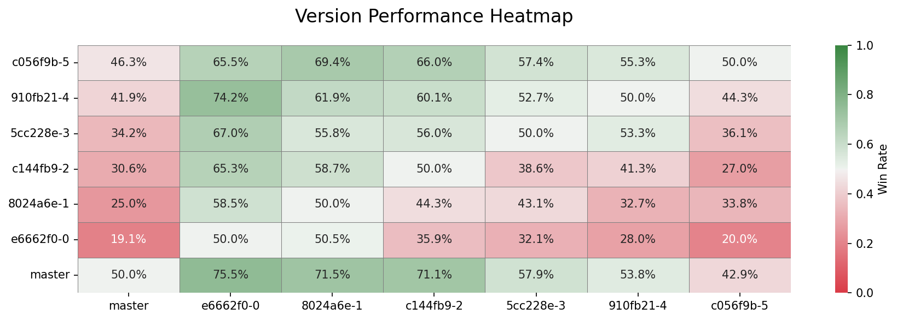

# Prokopakop

A moderately fast UCI chess engine written in Rust that **kops the Prokop**.

## Technical Features

### Move Generation

- **[Magic Bitboards](https://www.chessprogramming.org/Magic_Bitboards)** - Fast sliding piece move generation
- **[Generics](https://www.chessprogramming.org/Generic_Programming)** - Const generics for piece/color function variants
- **Iterative [Zobrist Hashing](https://www.chessprogramming.org/Zobrist_Hashing)** - Position hashing for transposition tables

<figure>
    
    <figcaption><em>Performance benchmarks across git commits on a i9-14900K. Benchmarks use perft 5, hashing and bulk-counting.</em></figcaption>
</figure>

### Search + Evaluation

- **[Alpha-Beta](https://www.chessprogramming.org/Alpha-Beta) Search** via **[Negamax](https://www.chessprogramming.org/Negamax)** - Negamax search with alpha-beta pruning
- **[Iterative Deepening](https://www.chessprogramming.org/Iterative_Deepening)** - Progressive search depth
- **[Move Ordering](https://www.chessprogramming.org/Move_Ordering)** - Principal Variation (PV) moves first, then Most Valuable Victim - Least Valuable Attacker (MVV-LVA)
- **[Quiescence Search](https://www.chessprogramming.org/Quiescence_Search)** - to avoid horizon effect
- **[Transposition Table](https://www.chessprogramming.org/Transposition_Table)** - Position caching to avoid re-searching identical positions

<figure>
    
    <figcaption><em>Tournament results heatmap showing win rates between different engine versions. Each cell shows the win rate of the row engine against the column engine.</em></figcaption>
</figure>

## Usage

### Build & Run
```bash
cargo run --release
```

### UCI Mode
Prokopakop implements most of the UCI (Universal Chess Interface) protocol for integration with chess GUIs:

```
uci                              # Initialize UCI mode
isready                          # Check engine readiness
ucinewgame                       # Start new game
position startpos                # Set starting position
position startpos moves <moves>  # Set position with moves
position fen <FEN>               # Set position from FEN
setoption name <id> value <val>  # Set engine options
go perft <depth>                 # Run perft test
go <params>                      # Search with various parameters
stop                             # Stop current search
quit                             # Exit engine
```

### Command Line Options
```bash
prokopakop                    # Start in UCI mode
prokopakop --magic            # Bootstrap magic bitboards
```

## Resources

- https://www.chessprogramming.org/Main_Page
- https://ameye.dev/notes/chess-engine/
- https://peterellisjones.com/posts/generating-legal-chess-moves-efficiently/
